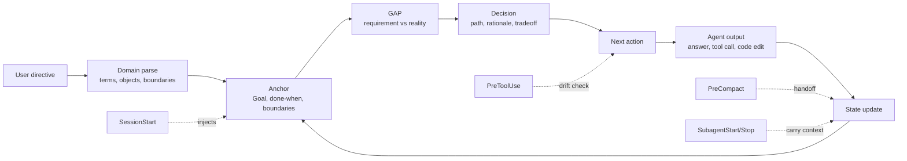

<div align="center">


<p><b>The orientation layer that keeps AI coding agents on-goal</b><br/>
across long sessions, context-window compaction, and subagent handoffs — on Claude Code, Codex, and any repo.</p>

<p>
<a href="https://github.com/tianjon/lodestar/actions/workflows/ci.yml"></a>
<a href="LICENSE"></a>
<a href="VERSION"></a>
<a href="https://github.com/tianjon/lodestar/stargazers"></a>
<a href="skills/lodestar/SKILL.md"></a>
<a href=".codex-plugin/plugin.json"></a>

</p>

<p><b>English</b> · <a href="README.zh.md">简体中文</a></p>

<p>
<a href="#-quick-start"><b>Quick start</b></a> ·
<a href="#-how-lodestar-works">How it works</a> ·
<a href="docs/README.md">Docs</a> ·
<a href="evals/README.md">Evals</a> ·
<a href="CONTRIBUTING.md">Contributing</a>
</p>

</div>

---

**Lodestar** is a portable, project-level **goal-orientation and anti-drift system** for **AI coding agents**. It gives
Claude Code, Codex, and any agent harness a durable **orientation layer** — the active goal, domain language,
open questions/gaps, decisions, and next action — that survives long sessions, **context-window compaction**, fresh
sessions, and **subagent handoffs**.

It is not a vector database and not another task playbook. Lodestar is the missing layer between *"remember
facts"* and *"execute a workflow"*: it tells the agent **why this work exists, what success means, what is out
of scope, and what to do next**. Its first principle is to hold the **real goal**, not merely the
written goal: resist recency noise, but proactively flag evidence that the user's priority has
changed. It does this with zero runtime dependencies (pure Markdown + protocol, plus optional
lifecycle hooks for enforcement).

```bash
git clone https://github.com/tianjon/lodestar.git ~/.lodestar && cd ~/.lodestar && ./install.sh
cd /path/to/your/project && ~/.lodestar/bin/lodestar init --hooks both
```

## Contents

- [🧭 Why AI agents drift](#-why-ai-agents-drift)
- [✨ What Lodestar does](#-what-lodestar-does)
- [🔁 How Lodestar works](#-how-lodestar-works)
- [🚀 Quick start](#-quick-start)
- [🎯 When to use Lodestar](#-when-to-use-lodestar)
- [🧱 Lodestar vs memory tools vs task skills](#-lodestar-vs-memory-tools-vs-task-skills)
- [📚 Documentation](#-documentation)
- [🧪 Evaluation](#-evaluation)
- [🔒 Safety & privacy](#-safety--privacy)
- [❓ FAQ](#-faq)
- [🤝 Contributing](#-contributing)

## 🧭 Why AI Agents Drift

AI coding agents are good at continuing the latest thread. Real projects need something more durable. Long
conversations, lossy summaries, fresh sessions, task skills, and subagents all pull the agent away from the
goal that started the work.

The failure mode is quiet: the agent stays fluent and productive, but it optimizes for the newest message
instead of the project outcome. Lodestar makes the current goal explicit, short, and **reloaded at the moments
where drift usually happens**.

## ✨ What Lodestar Does

| Capability | What it gives your AI coding agent |
|---|---|
| 🎯 **Project anchor** | `.lodestar/anchor.md` records Mode, Goal, Done-when, Boundaries, and Next action. |
| 🧭 **Goal-change diagnosis** | Evidence-backed re-anchor proposals when the written anchor no longer matches the real priority. |
| 🗺️ **Lightweight domain model** | `.lodestar/domain.md` captures terms, bounded contexts, core objects, capabilities, and open questions. |
| 📊 **Flat state & decisions** | `.lodestar/state.md` keeps current facts, open questions/gaps, evidence, and decision summaries visible without a heavy ledger. |
| 📝 **Meaningful log** | `.lodestar/log.md` records goal, evidence, decision, domain, and action changes — without becoming a transcript. |
| 🪝 **Lifecycle hooks** | Optional Claude Code & Codex hooks inject context on SessionStart, PreToolUse, PreCompact, SubagentStart, SubagentStop, and Stop. |
| 📦 **Portable skill** | Pure Markdown + bash. No runtime dependency, no lock-in to one agent harness. |

## 🔁 How Lodestar Works



The point is not to store more. The point is to make stored state **change the next answer, tool call, plan,
review, or code edit**. If the next action does not serve the active goal or a named gap, the agent should
surface the mismatch instead of silently following the tangent. If repeated or strong evidence
suggests the real goal changed, the agent should ask whether to re-anchor, raise a branch goal's
priority, or park the tangent — never silently rewrite the project goal.

## 🚀 Quick Start

### 1. Install the skill

```bash
git clone https://github.com/tianjon/lodestar.git ~/.lodestar
cd ~/.lodestar
./install.sh
```

`install.sh` links Lodestar into Claude Code and Codex skill locations when they exist. Runtime-specific and
pinned-install options:

```bash
./install.sh --claude        # Claude Code only
./install.sh --codex         # Codex only
./install.sh --copy          # copy instead of symlink (detach from this repo)
./install.sh --uninstall     # remove
```

Claude Code plugin install:

```text
/plugin marketplace add tianjon/lodestar
/plugin install lodestar@lodestar
```

### 2. Initialize a project

```bash
cd /path/to/your/project
~/.lodestar/bin/lodestar init
```

This creates:

```text
.lodestar/
├── anchor.md   # Mode / Goal / Done-when / Boundaries / Next action
├── domain.md   # light DDD map: language, contexts, objects, capabilities, scenarios
├── state.md    # current facts, open questions/gaps, decisions, evidence summaries
├── log.md      # meaningful changes only, not a transcript
└── archive/
```

Start with one sentence for `Goal`, an observable `Done-when`, clear `Boundaries`, and one `Next action`.

### 3. Turn on hooks when the project needs enforcement

```bash
~/.lodestar/bin/lodestar init --hooks both
~/.lodestar/bin/lodestar hooks status
```

Hooks are opt-in and reviewable. Codex users should review and trust configured hooks with `/hooks` before
expecting them to run.

## 🎯 When To Use Lodestar

**Use Lodestar when** (strongest where the goal itself moves across context loss — the regime the evals support):

- a goal or decision **changes partway** through a multi-session project;
- a project spans multiple sessions or context compactions;
- Claude Code, Codex, task skills, or subagents need a compact project handoff;
- domain language, decisions, and open questions/gaps need to remain visible over time.

**Skip Lodestar when:**

- the task is one short command or a single answer;
- the goal is fixed and obvious and finishes in one session — a strong model holds it unaided;
- you do not want project-local agent state.

## 🧱 Lodestar vs Memory Tools vs Task Skills

| Layer | Primary job | Examples | Lodestar's role |
|---|---|---|---|
| Recall substrate | Find past facts or documents | vector stores, project memory, knowledge bases | Complementary, but not enough by itself. |
| **Orientation layer** | Keep the agent aimed at goal, boundary, GAP, decision, next action | **Lodestar** | This project. |
| Procedural playbook | Execute a method such as TDD, debugging, review, planning | Superpowers, task skills | Lodestar sits underneath and names what the playbook serves. |
| Agent runtime | Run tools, shells, editors, subagents | Claude Code, Codex | Lodestar adapts through pointers and optional hooks. |

## 📚 Documentation

Full docs live in [`docs/`](docs/README.md) ([中文文档](docs/zh/README.md)):

- [Why Lodestar exists](docs/en/why-lodestar.md) — the orientation-decay problem
- [Design and architecture](docs/en/design.md) — core, hooks, light DDD, ports & adapters
- [How Lodestar shapes output](docs/en/output-path.md) — why state must change the next action
- [Why the approach is effective](docs/en/effectiveness.md) — cognitive grounding and honest limits
- [Open-source operating notes](docs/en/open-source.md) — promises and what we avoid

## 🧪 Evaluation

Lodestar ships a reproducible [eval harness](evals/README.md) — three arms (bare notes vs Lodestar vs an
equal-volume placebo reminder) — and reports results honestly, null and negative included. The pilot
[findings](evals/FINDINGS.md) so far:

- ✅ **Supported:** persisting information that *changes* across a context reset (a goal that shifts mid-run,
  decisions juggled across an interleaved multi-thread chat). The bare arm loses it; re-injected orientation keeps it.
- ✅ **Best default representation: flat summaries and append-only logs.** Across both no-merge and
  forced-consolidation pilots, flat notes beat agent-maintained structured memory. In Run 8, the
  GAP ledger came last even in the regime it was designed for: two forced merges, a status reopen,
  and a moving core goal.
- ❌ **Refuted for agent-maintained memory:** do not ask the agent to maintain a heavy GAP ledger or
  nested/tree state by default. GAP remains useful as a reasoning lens; deterministic tool-maintained
  structure is a different, still-untested system.
- ❌ **Not claimed:** "keep the model on a fixed goal" or "honor static constraints" — a strong model does those
  unaided (every static task hit a ceiling).

Smoke-test the harness without API spend:

```bash
bash evals/run.sh --agent mock --seeds 1 --iters 2
```

## 🔒 Safety & Privacy

- `.lodestar/` is added to `.gitignore` by default.
- Hooks load context and reminders; they do **not** silently rewrite project files.
- Never store secrets, credentials, private keys, customer data, private URLs, or personal data in Lodestar state.
- Share `.lodestar/` only after deliberate review and redaction.

## ❓ FAQ

<details>
<summary><b>Is Lodestar an AI memory system?</b></summary>

Partly, but the core value is orientation, not recall. Lodestar does not try to remember every sentence. It
keeps the active goal, boundary, domain language, open gaps/questions, decisions, and next action in a small project-local
control surface.
</details>

<details>
<summary><b>How is it different from Superpowers or other task skills?</b></summary>

Task skills describe *how* to work. Lodestar describes *what the work is for*. A debugging or TDD skill can run
inside a Lodestar-oriented project, but Lodestar names which goal or GAP the skill is serving.
</details>

<details>
<summary><b>Should I install Lodestar globally?</b></summary>

Usually no. Lodestar is best as a project-level anchor. Global rules are good for style and environment
conventions; project goals, boundaries, and decisions belong in the project.
</details>

<details>
<summary><b>Does Lodestar require hooks?</b></summary>

No. The core works as Markdown and protocol. Hooks make it more reliable by injecting context at lifecycle
points where agents often drift.
</details>

<details>
<summary><b>Does it replace AGENTS.md or CLAUDE.md?</b></summary>

No. `AGENTS.md` and `CLAUDE.md` remain excellent for environment and repository conventions. Lodestar adds a
small pointer so future sessions know where the project anchor lives.
</details>

## 🤝 Contributing

Issues, ideas, and pull requests are welcome. See [CONTRIBUTING.md](CONTRIBUTING.md) and
[CODE_OF_CONDUCT.md](CODE_OF_CONDUCT.md).

## ⭐ Star History

<a href="https://star-history.com/#tianjon/lodestar&Date">
  <picture>
    <source media="(prefers-color-scheme: dark)" srcset="https://api.star-history.com/svg?repos=tianjon/lodestar&type=Date&theme=dark" />
    
  </picture>
</a>

## License

[MIT](LICENSE) © Lodestar contributors

<div align="center"><sub>A lodestar is the star you steer by. Keep your agent pointed at it.</sub></div>
