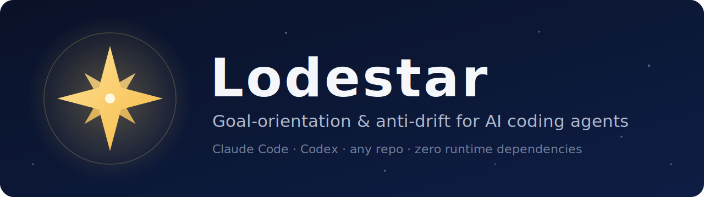
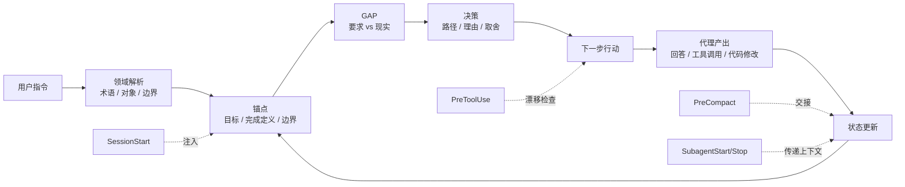

<div align="center">



<p><b>让 AI 编程代理始终对准目标的"定向层"</b><br/>
跨越长会话、上下文压缩与子代理交接 —— 适用于 Claude Code、Codex 及任意代码仓库。</p>

<p>
<a href="https://github.com/tianjon/lodestar/actions/workflows/ci.yml"></a>
<a href="LICENSE"></a>
<a href="VERSION"></a>
<a href="https://github.com/tianjon/lodestar/stargazers"></a>
<a href="skills/lodestar/SKILL.md"></a>
<a href=".codex-plugin/plugin.json"></a>

</p>

<p><a href="README.md">English</a> · <b>简体中文</b></p>

<p>
<a href="#-快速开始"><b>快速开始</b></a> ·
<a href="#-工作原理">工作原理</a> ·
<a href="docs/zh/README.md">中文文档</a> ·
<a href="evals/README.md">实验</a> ·
<a href="CONTRIBUTING.md">贡献指南</a>
</p>

</div>

---

**Lodestar** 是一套可移植的、项目级的 **AI 编程代理记忆与抗漂移系统**。它为 Claude Code、Codex 以及任意
agent harness 提供一个持久的**定向层**——当前目标、领域语言、开放的 GAP、决策与下一步行动——让这些信息
能够穿越长会话、**上下文压缩**、新会话与**子代理交接**而不丢失。

它不是向量数据库,也不是又一套任务流程手册。Lodestar 补的是 *"记住事实"* 与 *"执行流程"* 之间缺失的一层:
告诉代理**这件事为什么要做、成功长什么样、什么不在范围内、下一步做什么**——且**零运行时依赖**(纯 Markdown +
协议,外加可选的生命周期 hook 做强制)。

```bash
git clone https://github.com/tianjon/lodestar.git ~/.lodestar && cd ~/.lodestar && ./install.sh
cd /path/to/your/project && ~/.lodestar/bin/lodestar init --hooks both
```

## 目录

- [🧭 为什么 AI 代理会跑偏](#-为什么-ai-代理会跑偏)
- [✨ Lodestar 做什么](#-lodestar-做什么)
- [🔁 工作原理](#-工作原理)
- [🚀 快速开始](#-快速开始)
- [🎯 何时使用](#-何时使用)
- [🧱 与记忆工具、任务技能的关系](#-与记忆工具任务技能的关系)
- [📚 文档](#-文档)
- [🧪 效果验证](#-效果验证)
- [🔒 安全与隐私](#-安全与隐私)
- [🤝 参与贡献](#-参与贡献)

## 🧭 为什么 AI 代理会跑偏

AI 编程代理擅长"接着最近一句话往下做"。但真实项目需要更持久的东西。长对话、有损摘要、新会话、任务技能、
子代理——都会把代理从最初的目标上拉走。

失败往往是**悄无声息**的:代理依旧流畅、依旧勤奋,却在为最新的消息优化,而不是为项目结果优化。Lodestar 把当前
目标做得**明确、简短,并在最容易跑偏的时刻重新载入**。

## ✨ Lodestar 做什么

| 能力 | 给你的 AI 编程代理带来什么 |
|---|---|
| 🎯 **项目锚点** | `.lodestar/anchor.md` 记录模式、目标、完成定义、边界、下一步行动。 |
| 🗺️ **轻量领域模型** | `.lodestar/domain.md` 记录术语、限界上下文、核心对象、能力与开放问题。 |
| 📊 **GAP 与决策状态** | `.lodestar/state.md` 让当前事实、开放 GAP、证据与决策摘要持续可见。 |
| 📝 **有意义的日志** | `.lodestar/log.md` 只记录目标/证据/决策/领域/行动的变化,不沦为对话流水。 |
| 🪝 **生命周期 Hook** | 可选的 Claude Code / Codex hook,在 SessionStart、PreToolUse、PreCompact、SubagentStart/Stop、Stop 注入上下文。 |
| 📦 **可移植技能** | 纯 Markdown + bash,零运行时依赖,不绑定单一 agent harness。 |

## 🔁 工作原理



重点不是"记得更多",而是让记录下来的状态**真正改变下一次回答、工具调用、计划、review 或代码修改**。如果
下一步行动并不服务于当前目标或某个明确的 GAP,代理就应当把这种错位**显式指出来**,而不是默默跟着旁支跑。

## 🚀 快速开始

### 1. 安装技能

```bash
git clone https://github.com/tianjon/lodestar.git ~/.lodestar
cd ~/.lodestar
./install.sh
```

`install.sh` 会在 Claude Code 与 Codex 的技能目录存在时建立链接。可选参数:

```bash
./install.sh --claude        # 仅 Claude Code
./install.sh --codex         # 仅 Codex
./install.sh --copy          # 复制而非软链(脱离本仓库独立分发)
./install.sh --uninstall     # 卸载
```

Claude Code 插件方式安装:

```text
/plugin marketplace add tianjon/lodestar
/plugin install lodestar@lodestar
```

### 2. 初始化一个项目

```bash
cd /path/to/your/project
~/.lodestar/bin/lodestar init
```

会创建:

```text
.lodestar/
├── anchor.md   # 模式 / 目标 / 完成定义 / 边界 / 下一步行动
├── domain.md   # 轻量 DDD 地图:语言、上下文、对象、能力、场景
├── state.md    # 当前事实、开放 GAP、决策、证据摘要
├── log.md      # 只记有意义的变化,不是流水账
└── archive/
```

先用一句话写清 `Goal`、一个可观察的 `Done-when`、明确的 `Boundaries`,以及一个 `Next action`。

### 3. 需要强制时打开 hook

```bash
~/.lodestar/bin/lodestar init --hooks both
~/.lodestar/bin/lodestar hooks status
```

Hook 是可选、可审查的。Codex 用户需先用 `/hooks` 审查并信任已配置的 hook,它们才会生效。

## 🎯 何时使用

**适合用 Lodestar(目标本身会随上下文丢失而变化时最有用——这正是实验支持的场景):**

- 多会话项目中,目标或决策**中途发生变化**;
- 项目跨越多个会话或多次上下文压缩;
- Claude Code、Codex、任务技能或子代理之间需要紧凑交接;
- 领域语言、决策与开放 GAP 需要长期可见。

**不必用 Lodestar:**

- 任务只是一条命令或一次问答;
- 目标固定且显而易见、一个会话内完成——强模型不靠它也守得住;
- 你不想要项目本地的代理状态。

## 🧱 与记忆工具、任务技能的关系

| 层 | 主要职责 | 例子 | Lodestar 的位置 |
|---|---|---|---|
| 召回底座 | 找回过去的事实或文档 | 向量库、项目记忆、知识库 | 互补,但单靠它不够。 |
| **定向层** | 让代理始终对准目标、边界、GAP、决策、下一步 | **Lodestar** | 本项目。 |
| 流程手册 | 执行某种方法,如 TDD、调试、review、规划 | Superpowers、任务技能 | Lodestar 在其下方,指明该流程服务于哪个目标。 |
| 代理运行时 | 运行工具、shell、编辑器、子代理 | Claude Code、Codex | Lodestar 通过指针与可选 hook 适配。 |

## 📚 文档

完整文档见 [`docs/zh/`](docs/zh/README.md)([English docs](docs/en/README.md)):

- [为什么需要 Lodestar](docs/zh/why-lodestar.md) —— 定向衰减问题
- [设计与架构](docs/zh/design.md) —— 核心、hook、轻量 DDD、端口-适配器
- [Lodestar 如何影响 Agent 产出](docs/zh/output-path.md) —— 为什么状态必须改变下一步
- [为什么这套方法有效](docs/zh/effectiveness.md) —— 认知科学依据与诚实的边界
- [开源运营说明](docs/zh/open-source.md) —— 承诺与我们避免什么

## 🧪 效果验证

Lodestar 自带一套可复现的[实验框架](evals/README.md)(三臂:裸笔记 vs Lodestar vs 等量安慰剂提醒),并诚实
报告结果——空结果与负面结果一并报告。截至目前的 pilot [结论](evals/FINDINGS.md):

- ✅ **被支持:** 持久化"会变的信息"穿越上下文丢失(目标中途变、多线程聊天里跨线程的决策)。裸臂会丢,重注入的定向守得住。
- ✅ **最佳表示——扁平、追加式。** 在最难的多线程测试里,扁平笔记拿了满分,胜过散文,也胜过**树形**——树形**最差**,因为跨多次更新重渲染一棵树会丢信息。`minimal`(扁平)是推荐默认。
- ❌ **已被否决——不要给记忆文件加嵌套/树形结构:** 在代理自己跨冷重启维护时,结构越多反而越有害。
- ❌ **不宣称:** "守住固定目标"或"遵守静态约束"——强模型不靠它也能做(静态任务都撞了天花板)。

无需消耗 API,冒烟测试整条流水线:

```bash
bash evals/run.sh --agent mock --seeds 1 --iters 2
```

## 🔒 安全与隐私

- `.lodestar/` 默认加入 `.gitignore`。
- Hook 只加载上下文与提醒,**不会**静默改写项目文件。
- 切勿在 Lodestar 状态里存放密钥、凭证、私钥、客户数据、私有 URL 或个人数据。
- 只有在经过审查与脱敏之后,才分享 `.lodestar/`。

## 🤝 参与贡献

欢迎 issue、想法与 PR。请参阅 [CONTRIBUTING.md](CONTRIBUTING.md) 与 [CODE_OF_CONDUCT.md](CODE_OF_CONDUCT.md)。

## License

[MIT](LICENSE) © Lodestar contributors

<div align="center"><sub>Lodestar 是你用来导航的那颗星。让你的代理始终对准它。</sub></div>
