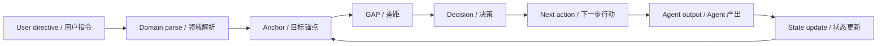

  
  
<a href="../README.md">← Back to project</a> · <a href="en/README.md">English docs</a> · <a href="zh/README.md">中文文档</a> · <a href="../evals/README.md">Evals</a>

# Lodestar Docs / Lodestar 文档

Lodestar is a project memory, goal-orientation, and anti-drift layer for AI coding agents such as
Claude Code and Codex. These docs explain why it exists, how the loop works, and how to evaluate
whether it improves agent output.

Lodestar 是面向 Claude Code、Codex 等 AI coding agent 的项目记忆、目标定向和 anti-drift 层。本目录解释它为什么存在、loop 如何工作，以及如何评估它是否真的改善 agent 产出。

Documents are split by language so each version can read naturally and stay easy to maintain.

文档按语言拆分，方便中英文版本分别自然表达、独立维护。

## Start Here / 从这里开始

| If you want to... | Read this |
|---|---|
| Understand the problem Lodestar solves | [Why Lodestar exists](en/why-lodestar.md) / [为什么需要 Lodestar](zh/why-lodestar.md) |
| See the architecture and hook model | [Design and architecture](en/design.md) / [设计与架构](zh/design.md) |
| Understand how state changes output | [How Lodestar shapes output](en/output-path.md) / [Lodestar 如何影响 agent 产出](zh/output-path.md) |
| Review the cognitive science and limits | [Why the approach is effective](en/effectiveness.md) / [为什么这套方法有效](zh/effectiveness.md) |
| Contribute or package Lodestar | [Open-source operating notes](en/open-source.md) / [开源运营说明](zh/open-source.md) |
| Test whether Lodestar has value | [Eval protocol](../evals/README.md) |

## Reading Path / 阅读路径

### English

Start with the [English docs home](en/README.md), or jump directly:

1. [Why Lodestar exists](en/why-lodestar.md)
2. [Design and architecture](en/design.md)
3. [How Lodestar shapes output](en/output-path.md)
4. [Why the approach is effective](en/effectiveness.md)
5. [Open-source operating notes](en/open-source.md)

### 中文

从 [中文文档首页](zh/README.md) 开始，或直接阅读：

1. [为什么需要 Lodestar](zh/why-lodestar.md)
2. [设计与架构](zh/design.md)
3. [Lodestar 如何影响 agent 产出](zh/output-path.md)
4. [为什么这套方法有效](zh/effectiveness.md)
5. [开源运营说明](zh/open-source.md)

## Short Version / 一句话版本

Lodestar is not a place to remember everything. It is a project-level orientation layer that keeps
an AI coding agent aligned with the current goal, domain language, gap, decision, and next action.

Lodestar 不是“什么都记住”的地方，而是项目级定向层：让 AI coding agent 始终围绕当前目标、领域语言、差距、决策和下一步行动工作。

## Key Concepts / 核心概念

- **Anchor / 锚点**: the smallest always-loaded control surface: mode, goal, done-when,
  boundaries, next action.
- **Domain Map / 领域地图**: lightweight DDD for terms, contexts, core objects, capabilities, and
  open questions.
- **GAP / 差距**: requirement vs current reality, with evidence and confidence.
- **Hooks / 生命周期 Hook**: optional enforcement points that load context before agents drift.
- **Loop / 闭环**: directive -> domain parse -> goal -> GAP -> decision -> next action -> output ->
  state update.

## Visual Loop / 可视化 Loop

